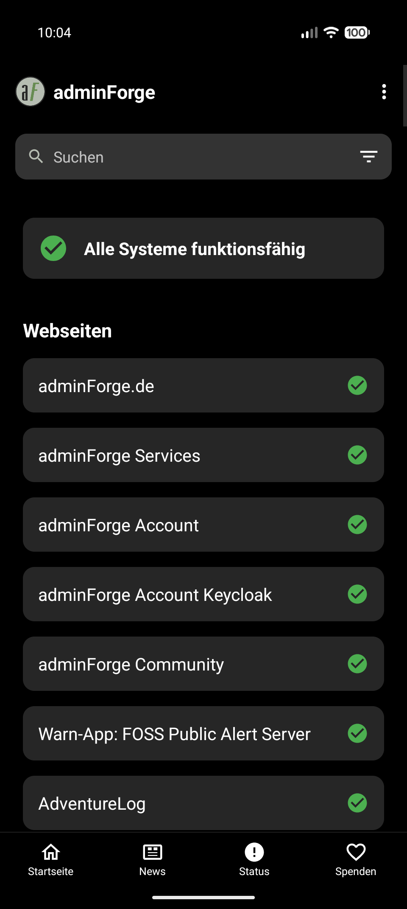
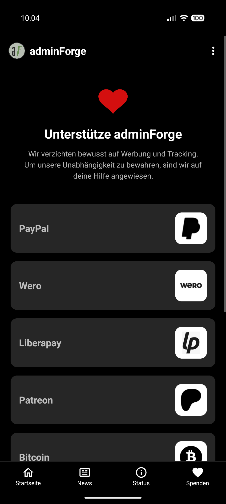

# adminForge Android App

Die offizielle Android-App für [adminForge](https://adminforge.de) – Deine Anlaufstelle für datenschutzfreundliche und werbefreie Open-Source-Dienste.

  

## Screenshots

  
  
  
  

## Features

- **Service-Verzeichnis**: Schneller Zugriff auf alle adminForge-Dienste (DNS, Metasuche, Cloud, Messenger u.v.m.).
- **News-Feed**: Aktuelle Neuigkeiten direkt vom adminForge-Blog.
- **System-Status**: Echtzeit-Monitoring aller adminForge-Infrastrukturen.
- **Native Experience**: Modernes Design mit OLED-Schwarz-Modus und intuitiver Navigation.
- **Benachrichtigungen**: Support für UnifiedPush (z.B. via ntfy) und zuverlässiges Background-Polling.
- **Updates**: Integrierte Update-Funktion für die neuesten Features.

## Installation

Lade die aktuellste Version direkt von unserem Git-Repository herunter:  
👉 **[git.adminforge.de/adminforge/android-app/releases/latest](https://git.adminforge.de/adminforge/android-app/releases/latest)**

## Technologien

- **Sprache**: Kotlin
- **Architektur**: Modernes Android mit WorkManager, Coroutines und Material Design.
- **Push**: UnifiedPush Integration.
- **Privacy**: Kein Tracking, keine Werbung, keine Google Play Services Abhängigkeit.

## App Signature (Zertifikat)

Alle offiziellen APK-Releases sind mit dem adminForge-Zertifikat signiert. Du kannst die Integrität der App mit folgendem SHA256-Fingerprint überprüfen:

**SHA256 Fingerprint:**
`D3:A9:7C:72:BB:24:F3:0B:34:68:74:99:0C:21:30:95:22:B5:58:62:8F:EB:14:B5:45:32:5D:FB:0F:0B:1D:F9`

## Lizenz

Dieses Projekt ist unter der **GNU GPL v3.0** lizenziert. Weitere Details findest du in der [LICENSE](LICENSE) Datei.

---
Betrieben mit ❤️ und erstellt mit 🤖 von [adminForge](https://adminforge.de).
